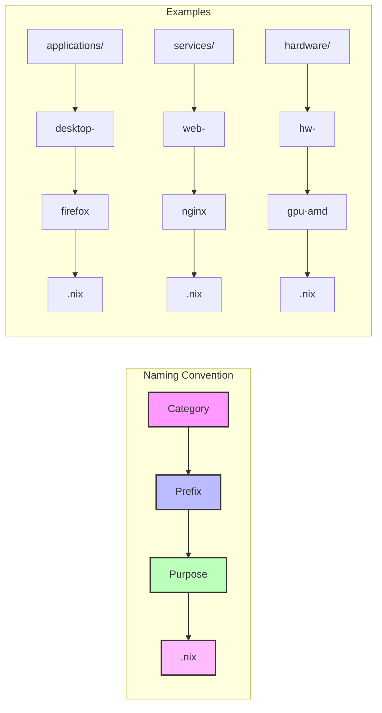
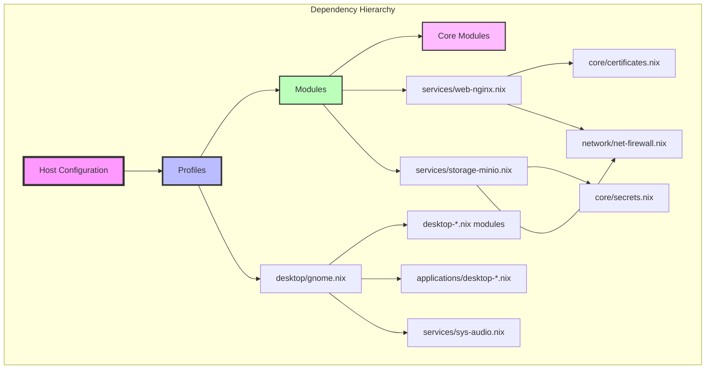
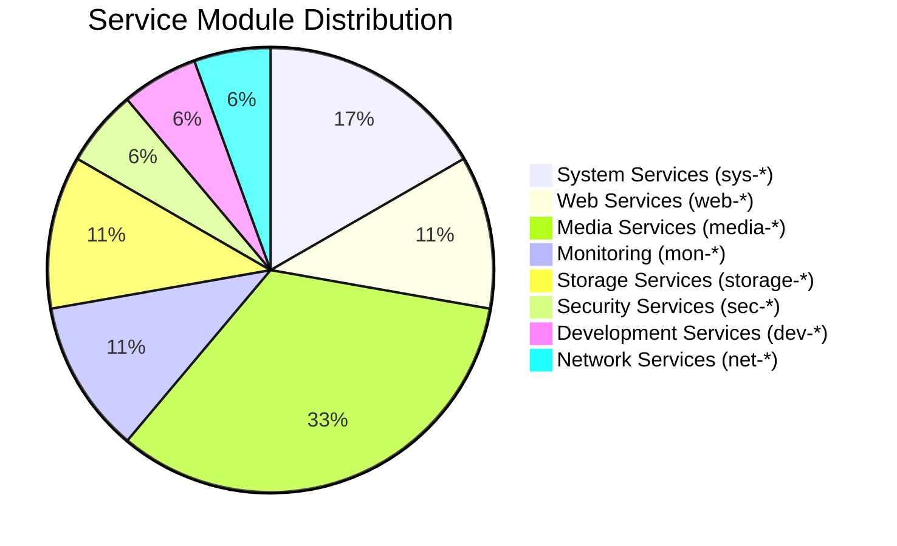
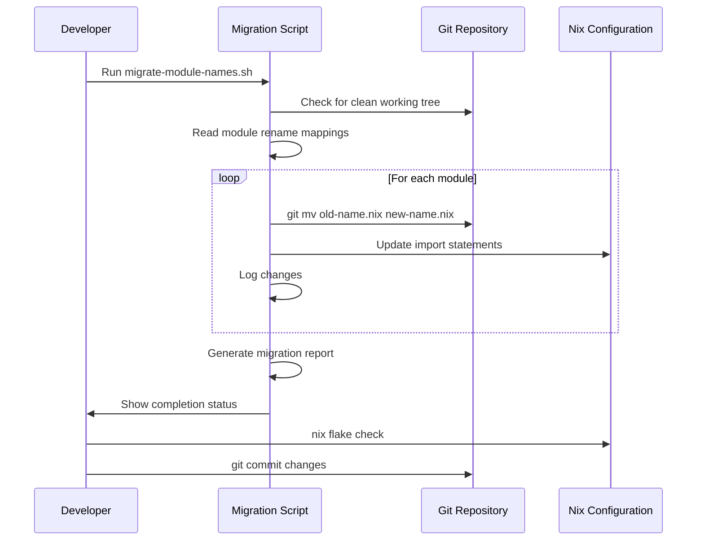

# Module Structure Diagram

```mermaid
graph TD
    subgraph "Module Categories"
        A[modules/] --> B[applications/]
        A --> C[core/]
        A --> D[desktop/]
        A --> E[hardware/]
        A --> F[network/]
        A --> G[services/]
        A --> H[users/]
    end

    subgraph "Applications"
        B --> B1[desktop-*.nix<br/>GUI Applications]
        B --> B2[cli-*.nix<br/>Command Line Tools]
        B --> B3[dev-*.nix<br/>Development Tools]
        B --> B4[game-*.nix<br/>Gaming Applications]
    end

    subgraph "Core"
        C --> C1[boot.nix]
        C --> C2[nix.nix]
        C --> C3[security.nix]
        C --> C4[shell/<br/>Shell Environment]
    end

    subgraph "Services"
        G --> G1[sys-*.nix<br/>System Services]
        G --> G2[web-*.nix<br/>Web Services]
        G --> G3[media-*.nix<br/>Media Services]
        G --> G4[mon-*.nix<br/>Monitoring]
        G --> G5[storage-*.nix<br/>Storage Services]
        G --> G6[sec-*.nix<br/>Security Services]
        G --> G7[dev-*.nix<br/>Dev Services]
        G --> G8[net-*.nix<br/>Network Services]
    end

    style A fill:#f9f,stroke:#333,stroke-width:4px
    style B fill:#bbf,stroke:#333,stroke-width:2px
    style C fill:#bfb,stroke:#333,stroke-width:2px
    style D fill:#fbf,stroke:#333,stroke-width:2px
    style E fill:#ffb,stroke:#333,stroke-width:2px
    style F fill:#bff,stroke:#333,stroke-width:2px
    style G fill:#fbb,stroke:#333,stroke-width:2px
    style H fill:#bfb,stroke:#333,stroke-width:2px
```

## Module Naming Patterns

## Module Dependencies

## Service Module Categories

## Module Migration Flow

These diagrams illustrate:
1. The overall module structure and organization
2. The naming convention pattern
3. Module dependency relationships
4. Distribution of service modules by category
5. The migration process workflow
